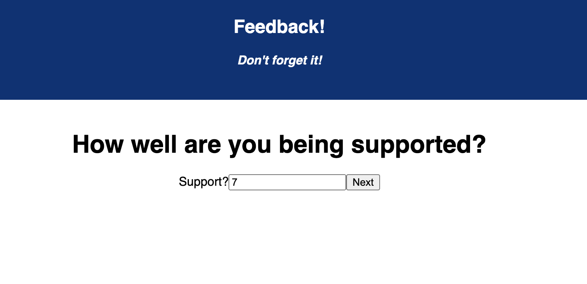

# Feedback Loop

## Description

_Duration: 11 Hours_

This is a feedback form that uses required inputs to send response data to a database. One of the primary challenges of this was using multiple components so each feedback question was on its own page, but collect all inputs at the end to display before being submitted to a database. I utilized storing the feedback data in an object on the index page that received data to its properties via dispatches on the client..

## Screen Shots

### Prerequisites

Link to software that is required to install the app (e.g. node).

- [Node.js](https://nodejs.org/en/)
- database software, [Postico] used for setting up this project (https://eggerapps.at/postico/)

## Installation

1. Using preferred database software, use `data.sql` to setup a database called `prime_feedback`.
2. Using a terminal in the project directory, run `npm install`.
3. Once installation is complete, run `npm run server`.
4. After the server is running, open another terminal instance and run `npm run client`.
5. Development environment should start up automatically in a browser. If there are any issues on setup, a good first place to check are the depencies in `package.json`.

## Usage

1. To use the app, press the `Go` button on the Home page to begin providing feedback about your learning experience.
2. There are four feedbacks for Feeling, Understanding, Support, and Comments. All are require positive integers except for Comments.
3. Upon providing an input (option on Comments), click the Next button to proceed to following step.
4. After the flow of the feedback views, the review page will display your inputs. Once ready, press the `Done` button which will send the feedback data to the `feedback` database table. This will route the web page back to the Home page to begin again.

## Built With

This project was built with React, JavaScript, and PostgreSQL

## License

## Acknowledgement
Thanks to [Prime Digital Academy](www.primeacademy.io) who equipped and helped me to make this application a reality and everyone in my cohort for helping to create such an incredible learning environment!
